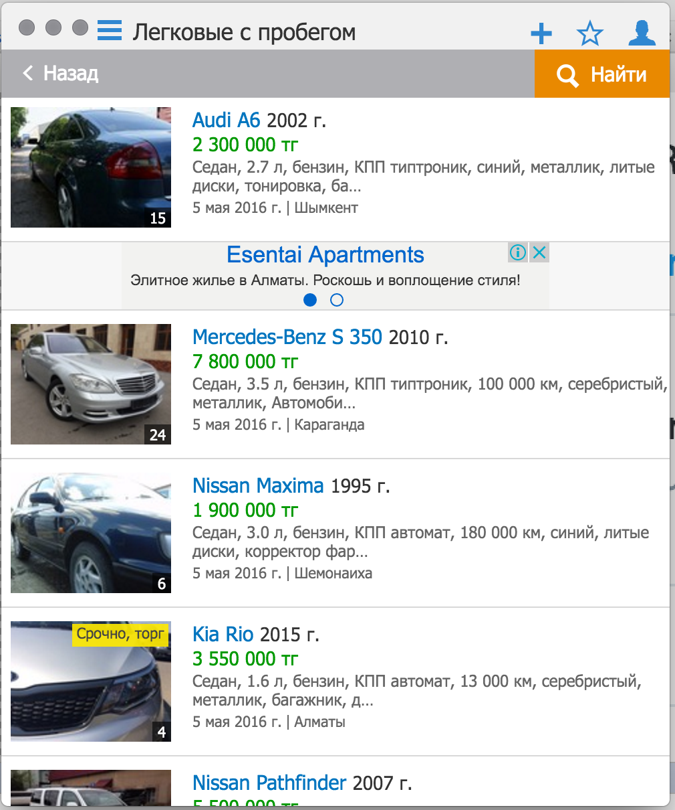

# Kolesik

> Pristine Kolesa app

Fork of sindresorhus/[Anatine](https://github.com/sindresorhus/anatine)

<br>
<div align="center">
	<a href="https://github.com/vko-online/kolesik/releases/latest" align="center">
		
	</a>
</div>


## Install

*OS X 10.9+, Windows 7+ & Linux are supported.*

### OS X

[**Download**](https://github.com/vko-online/kolesik/releases/latest), unzip, and move `Kolesik.app` to the `/Applications` directory.

### Linux

[**Download**](https://github.com/vko-online/kolesik/releases/latest) and unzip to some location.

To add a shortcut to the app, create a file in `~/.local/share/applications` called `kolesik.desktop` with the following contents:

```
[Desktop Entry]
Name=Kolesik
Exec=/full/path/to/folder/Kolesik
Terminal=false
Type=Application
Icon=/full/path/to/folder/Kolesik/resources/app/media/Icon.png
```

### Windows

[**Download**](https://github.com/vko-online/kolesik/releases/latest) and unzip to some location.


## Dev

Built with [Electron](http://electron.atom.io).

###### Commands

- Init: `$ npm install`
- Run: `$ npm start`
- Build OS X: `$ npm run build:osx`
- Build Linux: `$ npm run build:linux`
- Build Windows: `$ npm run build:windows`
- Build all: `$ brew install wine` and `$ npm run build` *(OS X only)*


## Related

- [Anatine](https://github.com/sindresorhus/anatine) - Prestine Twitter app


## License

MIT © [Medet Tleukabiluly](https://twitter.com/Tileukabiluly)
